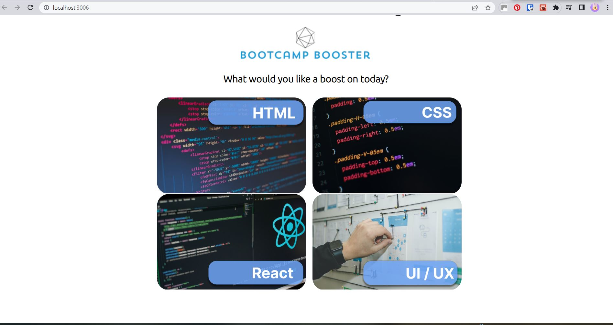
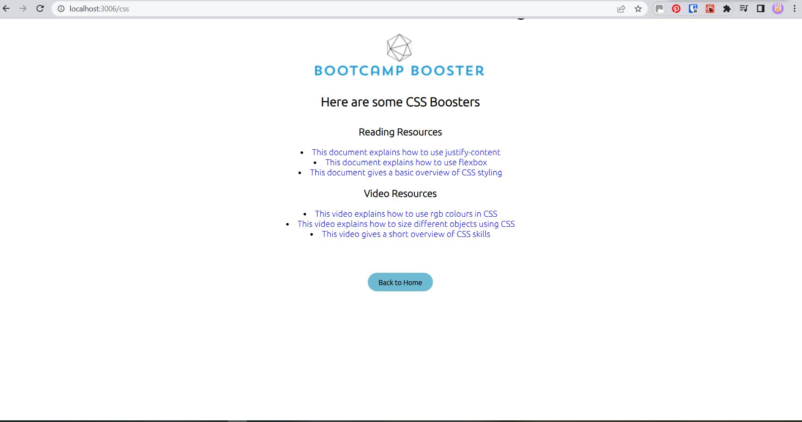
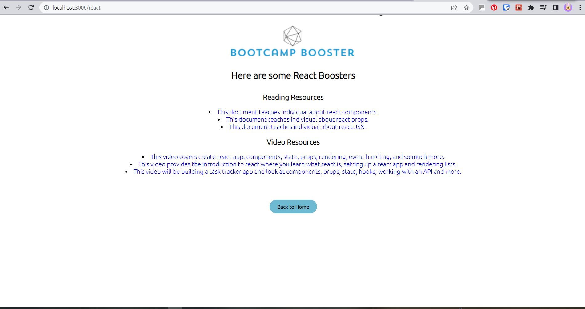
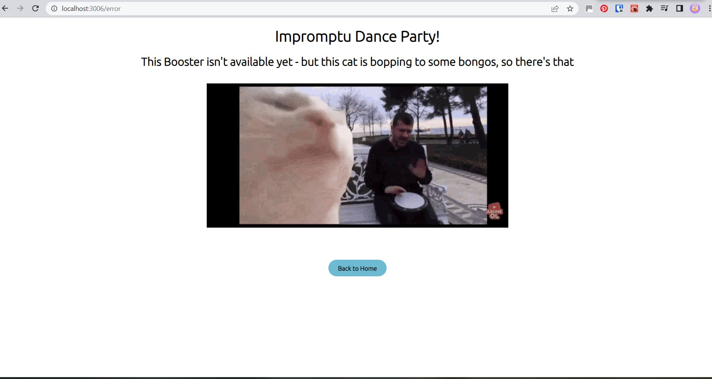

# Bootcamp Booster

This week-long team project was centred on a brief of identifying a problem faced by bootcampers, and creating a solution for this problem.

Bootcamp Booster is our solution for providing curated resources to bootcampers who want to further their studies, to cut-down the amount of time spent searching and sifting through search results to find appropriate and helpful information.

## Authors

- [@lalicia](https://www.github.com/lalicia)
- [@stardust5555](https://www.github.com/stardust5555)
- [@Ceejay222](https://www.github.com/Ceejay222)
- [@mbn-bsr](https://www.github.com/mbn-bsr)
- [@abdul-aziz93](https://www.github.com/abdul-aziz93)

## Documentation

[Documentation](https://github.com/lalicia/bootcamp_booster/blob/main/DOCUMENTATION.md)

## Lessons Learned

We faced a number of challenges while working on the project, not least of all meeting as a new team, identifying what we wanted to make, and completing our MVP within a week - as well as preparing and delivering a presentation to industry experts!

While building the app we had to research how to create new pages, and then learn and implement React Router within a very short window of time.

We'd also never linked a React frontend with an Express backend, so this was another new thing we had to learn - and crucial to the functionality of the entire application.

## Optimisations

To optimise our code, we ensured folder structure and naming conventions were clear throughout, removed any unused imports/unhelpful comments, and any planning remnants. We also looked at accessibility, and improved the Lighthouse score to 100 by adding aria roles and alt texts.

We tried to use a clean, clear layout for our code throughout, with 'whitespace' to improve overall readability.

We removed inline styles and put these in our central CSS file, taking the decision that our CSS wasn't extensive enough at this version to warrant CSS modules. If adding further functionality/styling in the future, CSS modules would be something we would consider.

## Tech Stack

**Client:** React, Create React App, React Router, Cypress

**Server:** Node, Express, Dotenv, Postgres, CORS

### Useful Links

- [React Beta Docs](https://beta.reactjs.org/)
- [React Router V6 Getting Started](https://reactrouter.com/docs/en/v6/getting-started/overview)
- [Cypress Documentation](https://docs.cypress.io/guides/overview/why-cypress)
- [Node.js Documentation](https://nodejs.org/en/docs/)
- [Express Getting Started](https://expressjs.com/en/starter/installing.html)
- [Dotenv Documentation](https://www.npmjs.com/package/dotenv)
- [Postgres Documentation](https://node-postgres.com/)
- [CORS Documentation](https://www.npmjs.com/package/cors)

## Screenshots

Homepage upon starting/opening application:

Example Topic Pages once selected from Homepage:

Error Page to catch address bar typos or topics currently unavailable:

